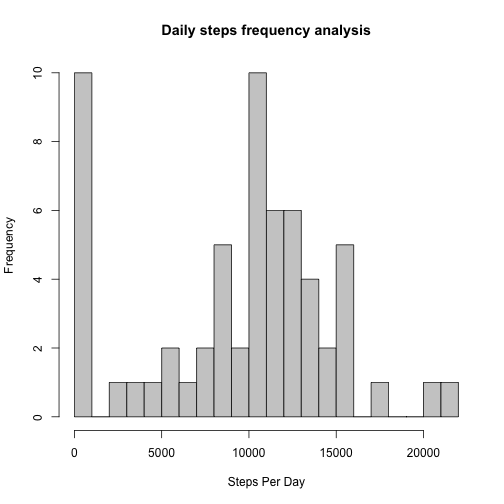
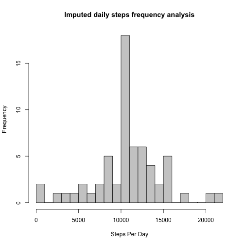
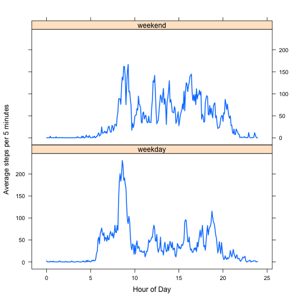

First Reproducible Research Project -- Brian Davies
===================================================

Loading and Processing the Data
-------------------------------

I'm going to cache this as it's a bit time consuming.


```r
download.file("https://d396qusza40orc.cloudfront.net/repdata%2Fdata%2Factivity.zip", 
    destfile = "activity.zip", method = "curl")
unzip("activity.zip")
activityFrameScratch <- read.csv("activity.csv", header = TRUE)
activityFrame <- data.frame(activityFrameScratch$date, activityFrameScratch$interval, 
    activityFrameScratch$steps)
rm(activityFrameScratch)
colnames(activityFrame) <- c("date", "interval", "steps")
head(activityFrame)
```

```
##         date interval steps
## 1 2012-10-01        0    NA
## 2 2012-10-01        5    NA
## 3 2012-10-01       10    NA
## 4 2012-10-01       15    NA
## 5 2012-10-01       20    NA
## 6 2012-10-01       25    NA
```


Analysis of Steps Taken Per Day
--------------------------------

Get summary stats for steps per day. That function is probably a bit
more complicated than it needs to be, but never mind...


```r
dailySteps <- aggregate(activityFrame$steps, list(activityFrame$date), function(x) {
    sum(x, na.rm = TRUE)
})
head(dailySteps)
```

```
##      Group.1     x
## 1 2012-10-01     0
## 2 2012-10-02   126
## 3 2012-10-03 11352
## 4 2012-10-04 12116
## 5 2012-10-05 13294
## 6 2012-10-06 15420
```


... and plot them and summarize them ...


```r
hist(dailySteps$x, breaks = 16, col = " gray80", xlab = "Steps Per Day", main = "Daily steps frequency analysis")
```

 

```r
summary(dailySteps$x)
```

```
##    Min. 1st Qu.  Median    Mean 3rd Qu.    Max. 
##       0    6780   10400    9350   12800   21200
```


The output from __summary()__ is good enough for EDA purposes.

Average Daily Activity Pattern
------------------------------

Should be easy enough to calculate daily average summary using same general
strategy as daily sums ...


```r
intervalStepsAvg <- aggregate(activityFrame$steps, list(as.factor(activityFrame$interval)), 
    "mean", na.rm = TRUE)
length(intervalStepsAvg$Group.1)
```

```
## [1] 288
```

```r
head(intervalStepsAvg)
```

```
##   Group.1       x
## 1       0 1.71698
## 2       5 0.33962
## 3      10 0.13208
## 4      15 0.15094
## 5      20 0.07547
## 6      25 2.09434
```


There are 288 five-minute periods in a day, and the result frame
has 288 rows.

Analysing the results ...


```r
plot(intervalStepsAvg$x, type = "l", xlab = "Interval", ylab = "Steps", main = "Average steps by 5-minute interval")
```

 

```r
which.max(intervalStepsAvg$x)
```

```
## [1] 104
```

Step 104 is 8.5833 hours into the day. The graph looks  kinda credible
i.e. almost no steps in the early morning.

Imputing Missing Values
-----------------------

Using the __is.na()__ function, there are 2304
missing step counts.

RIGHT, I just noticed that those nice little interval designators in the raw
data do things like this:


```r
head(activityFrame$interval, 15)
```

```
##  [1]   0   5  10  15  20  25  30  35  40  45  50  55 100 105 110
```


See how they go from 55 to 100? That means they're basically __hhmm__ with
the __hh__ omitted if possible. I can't be bothered to figure out
the time libraries so I'm going to write a little function to turn them
into minute counts to generate an index into the averages frame.


```r
Interval2Minutes <- function(interval) {
    interval <- as.integer(interval)
    hours_part <- floor(interval/100)
    minutes_part <- interval - 100 * hours_part
    minutes <- hours_part * 60 + minutes_part
    minutes
}
Interval2Minutes(245)
```

```
## [1] 165
```

```r
Interval2Minutes(c(100, 250))
```

```
## [1]  60 170
```

```r
Interval2Minutes(c("100", "250"))
```

```
## [1]  60 170
```


Just check that __intervalStepsAvg__ is in the right order. This should be zero:


```r
which(as.numeric(as.character(intervalStepsAvg$Group.1))[2:288] <= as.numeric(as.character(intervalStepsAvg$Group.1))[1:287])
```

```
## integer(0)
```


Right, we're ready to go!


```r
indexMissingSteps <- which(is.na(activityFrame$steps))
intervalMissingSteps <- activityFrame$interval[indexMissingSteps]
indexWantedSteps <- Interval2Minutes(intervalMissingSteps)/5 + 1
wantedSteps <- as.integer(round(intervalStepsAvg$x[indexWantedSteps]))
activityFrameImputed <- activityFrame
activityFrameImputed$steps[indexMissingSteps] <- wantedSteps
```


And now we analyze the results.


```r
dailyStepsImputed <- aggregate(activityFrameImputed$steps, list(activityFrameImputed$date), 
    function(x) {
        sum(x, na.rm = TRUE)
    })
hist(dailyStepsImputed$x, breaks = 16, col = " gray80", xlab = "Steps Per Day", 
    main = "Imputed daily steps frequency analysis")
```

 

```r
summary(dailyStepsImputed$x)
```

```
##    Min. 1st Qu.  Median    Mean 3rd Qu.    Max. 
##      41    9820   10800   10800   12800   21200
```


Weekday/Weekend Activity Patterns
---------------------------------

I built the following up after a lot of trial and error! Ternary
logical __ifelse()__ is a BIG help here.


```r
activityFrameImputed$dayType <- as.factor(ifelse(grepl("^S.+day$", weekdays(as.Date(activityFrameImputed$date))), 
    "weekend", "weekday"))
```


Now use a slightly different __aggregate()__

I've also added an __hours__ column to give the (fractional) hour of day so I
can use an __xyplot__ without the obvious gaps in the exemplar in
the briefing notes


```r
intervalStepsAvgByType <- aggregate(activityFrameImputed$steps, list(as.factor(activityFrame$interval), 
    activityFrameImputed$dayType), "mean")
intervalsHours <- seq(0, 23.999, 5/60)
intervalStepsAvgByType$hours <- c(intervalsHours, intervalsHours)
colnames(intervalStepsAvgByType) <- c("interval", "dayType", "steps", "hours")
head(intervalStepsAvgByType)
```

```
##   interval dayType   steps   hours
## 1        0 weekday 2.28889 0.00000
## 2        5 weekday 0.40000 0.08333
## 3       10 weekday 0.15556 0.16667
## 4       15 weekday 0.17778 0.25000
## 5       20 weekday 0.08889 0.33333
## 6       25 weekday 1.57778 0.41667
```

```r
tail(intervalStepsAvgByType)
```

```
##     interval dayType  steps hours
## 571     2330 weekend  1.438 23.50
## 572     2335 weekend 11.625 23.58
## 573     2340 weekend  6.250 23.67
## 574     2345 weekend  1.750 23.75
## 575     2350 weekend  0.000 23.83
## 576     2355 weekend  0.125 23.92
```


OK, ready to do the graph!


```r
library("lattice")
xyplot(intervalStepsAvgByType$steps ~ intervalStepsAvgByType$hours | intervalStepsAvgByType$dayType, 
    type = "l", lwd = 2, layout = c(1, 2), xlab = "Hour of Day", ylab = "Average steps per 5 minutes")
```

 


Some pretty obvious differences there, I'd say.

* Gets up later at weekends
* Lower morning peak at weekends (no walk to work?)
* More late-night activity at weekends
